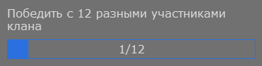

# Progress Bar

```json
{
  "id": 1,
  "type": "pbar",
  "name": "",
  "current": 10,
  "goal": 100,
  "reach_goal": false,
  "notification": "",
  "color": "",
  "background": "",
  "description": ""
}
```


